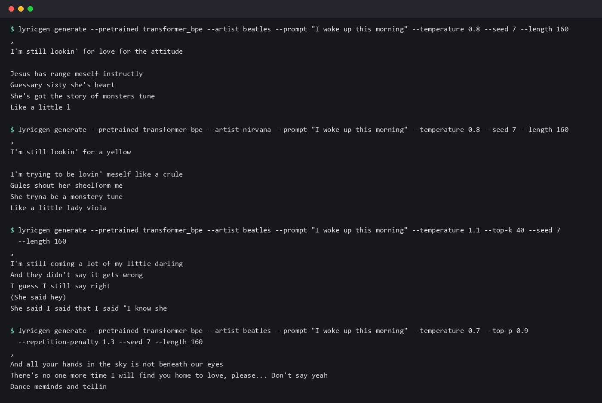

# lyricgen

This started as a Keras LSTM that wrote song lyrics one character at a time. I rebuilt it in PyTorch to find
out how much of the quality came from the model and how much from the data, so it now trains four
architectures on the same split, lets you pick the artist to write in the style of, and measures how much of
the training text it copies back.



## How it works

- The lyric files are not in the tree. `scripts/fetch_data.py` restores them from this repo's history, then
  `lyricgen prepare` cleans them, drops duplicate stanzas and makes a per-artist train/validation/test split.
- A model reads the text as characters (or 2000 BPE tokens) plus an artist embedding, and predicts the next
  token. Dropping the artist 10% of the time also teaches it an "any artist" mode.
- Generation supports temperature, top-k, top-p and a repetition penalty, with a key/value cache that made
  the transformer about twice as fast at sampling.
- `lyricgen evaluate` reports bits per character on the test split and checks memorization: how many of the
  generated word n-grams never appear in the training text, with real held-out lyrics as the reference.

## Results

Same data, same seed, same 12.3M training tokens, trained on a laptop CPU.

| model | params | test bits/char | test char perplexity | novel 6-grams |
| --- | --- | --- | --- | --- |
| LSTM 256 to 128 (the original) | 0.59M | 2.608 | 6.10 | 1.000 |
| GRU 256 to 128 | 0.45M | 2.295 | 4.91 | 1.000 |
| transformer, characters | 3.28M | 2.168 | 4.49 | 0.998 |
| transformer, BPE | 3.75M | 1.892 | 3.71 | 0.972 |

Real held-out lyrics score 0.462 on that last column, so the models are inventing rather than replaying, and
the better ones copy more. Full numbers, training curves and the artist-conditioning check are in
[docs/experiments.md](docs/experiments.md).

## Run it

```bash
pip install -r requirements.txt && pip install -e .
lyricgen download transformer_bpe                     # or train your own, below
lyricgen generate --pretrained transformer_bpe --artist beatles --prompt "I woke up this morning"
lyricgen demo --pretrained transformer_bpe            # local web UI, needs requirements-demo.txt
```

To train from scratch: `python scripts/fetch_data.py && lyricgen prepare`, then
`lyricgen train --config configs/transformer_bpe.yaml`. The four checkpoints above are attached to the
[v0.2.0 release](https://github.com/Raaif-Yousuf/AI-Song-lyrics-Generation/releases/tag/v0.2.0).

`pytest -q` runs 220 tests (data cleaning, tokenizers, every model, sampling, training, evaluation) and they
run on every pull request.

The lyrics themselves are copyrighted and are not redistributed here. Code is MIT licensed.
