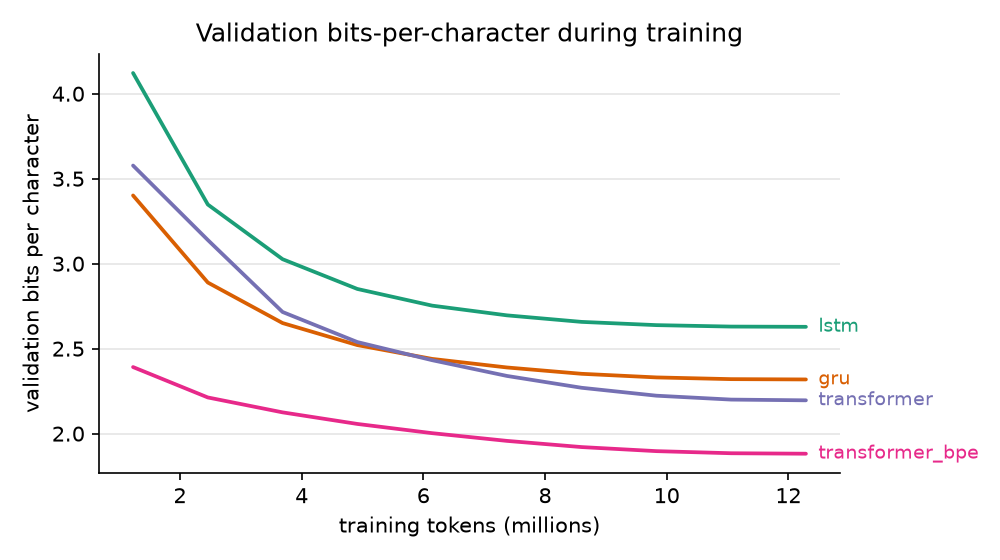

# Experiments

Everything here was measured by me on one Windows laptop (16 logical cores, CPU only, PyTorch 2.14).
Reproduce a row with `lyricgen train --config configs/<name>.yaml` followed by
`lyricgen evaluate --checkpoint runs/<name>/best.pt --data data/processed --out runs/<name>/eval.json`.

## Setup

- Data: 47 artists, 5.27M characters of training text, 0.66M each for validation and test (see `docs/data.md`).
- Budget: every model saw the same 12.3M training tokens (1500 steps, batch 32, context 256), the same split
  and the same seed. Learning rates are common defaults per family (2e-3 for the RNNs, 1e-3 for the
  transformers), not tuned, with 100 warmup steps and cosine decay.
- Loss is reported as bits per character so the character and BPE models are directly comparable: the BPE
  model's total negative log likelihood is divided by the number of characters, not tokens.
- The four runs were trained at the same time with four threads each, so the wall-clock and tokens/sec
  columns are throughput under that sharing, not a clean single-model benchmark.

## Results

| model | tokenizer | params | val bpc | test bpc | test char perplexity | train tok/s | train time |
| --- | --- | --- | --- | --- | --- | --- | --- |
| lstm | char (154) | 591,772 | 2.604 | 2.608 | 6.10 | 12,863 | 16 min |
| gru | char (154) | 451,740 | 2.290 | 2.295 | 4.91 | 7,345 | 28 min |
| transformer | char (154) | 3,277,312 | 2.162 | 2.168 | 4.49 | 1,943 | 105 min |
| transformer_bpe | BPE (2000) | 3,749,376 | 1.882 | 1.892 | 3.71 | 1,691 | 121 min |

The ordering is what the literature would predict, but the cost is not: the LSTM baseline is 7.6x faster to
train per token than the character transformer on this CPU, and the transformer needs all of that extra
compute to buy 0.44 bits. Subword tokenization is the cheapest win in the table. It covers about 3.5
characters per token, so at an equal token budget it also sees more text, which is part of why it wins.

None of the runs had flattened at 1500 steps; the best checkpoint was the last one in every case.

## Does the artist conditioning do anything?

Every model gets an artist embedding, and 10% of training examples have it replaced by an "any artist" id so
the model can also generate unconditionally. Scoring the test split three ways, with the true artist, with
"any artist", and with a deliberately wrong artist (a seeded derangement):

| model | true artist | any artist | wrong artist |
| --- | --- | --- | --- |
| lstm | 2.608 | 2.617 | 2.625 |
| gru | 2.295 | 2.313 | 2.332 |
| transformer | 2.168 | 2.197 | 2.212 |
| transformer_bpe | 1.892 | 1.928 | 1.970 |

The gap is real but small, and it grows with model capacity: 0.009 bits for the LSTM, 0.036 for the BPE
transformer. Per artist it is largest exactly where you would expect, for the corpora that do not read like
modern pop lyrics: Emily Dickinson (0.097 bits), nursery rhymes (0.112) and Dr. Seuss (0.138) for the BPE
transformer, against 0.017 for Alicia Keys. With 47 artists and a few hundred KB of text each, the models
learn a weak style prior, not an identity.

## Is it memorizing?

`lyricgen evaluate` samples 16 generations of 300 characters, spread over artists and prompted with the first
line of a held-out stanza, then measures the share of word n-grams that never occur in the training split.
Real held-out lyrics are scored the same way as a reference point, because choruses and stock phrases repeat
across songs.

| model | novel 4-grams | novel 6-grams | novel 8-grams | longest copied run (mean / max words) |
| --- | --- | --- | --- | --- |
| lstm | 0.994 | 1.000 | 1.000 | 3.4 / 4 |
| gru | 0.971 | 1.000 | 1.000 | 3.9 / 5 |
| transformer | 0.958 | 0.998 | 0.999 | 4.4 / 11 |
| transformer_bpe | 0.861 | 0.972 | 0.989 | 6.4 / 23 |
| held-out real lyrics | 0.421 | 0.462 | 0.495 | 13.4 / 32 |

Copying rises with capacity, which is the honest version of "the samples got better": the BPE transformer
reproduces a 23-word run at one point. It still copies less than a real unseen lyric shares with the training
set, so the models are not simply replaying the corpus, but this is the number I would watch if the models
were scaled up.

Diversity moves the same way. Distinct-2 (share of unique word bigrams) is 0.906 for the LSTM and 0.713 for
the BPE transformer, against 0.941 for real held-out text, and repeated lines are rare everywhere
(0.6% of lines for the BPE transformer, 0% for the rest).

## Sampling settings

`scripts/sampling_sweep.py` runs the same memorization and diversity metrics across decoding settings for one
checkpoint. Numbers below are for the character transformer, 12 samples of 250 characters each.

| temperature | top-k | top-p | repetition penalty | novel 6-grams | distinct-2 | repeated lines | longest copied run (mean words) |
| --- | --- | --- | --- | --- | --- | --- | --- |
| 0.500 | 0 | 1.000 | 1.000 | 0.997 | 0.740 | 0.000 | 4.7 |
| 0.800 | 0 | 1.000 | 1.000 | 0.997 | 0.883 | 0.000 | 4.2 |
| 1.000 | 0 | 1.000 | 1.000 | 1.000 | 0.959 | 0.000 | 3.5 |
| 1.200 | 0 | 1.000 | 1.000 | 1.000 | 0.972 | 0.000 | 3.2 |
| 0.800 | 0 | 0.900 | 1.000 | 0.997 | 0.866 | 0.000 | 5.1 |
| 0.800 | 20 | 1.000 | 1.000 | 0.995 | 0.901 | 0.000 | 4.2 |
| 0.800 | 0 | 1.000 | 1.200 | 1.000 | 0.944 | 0.000 | 3.8 |

Temperature does what you expect: at 0.5 the text is repetitive (distinct-2 drops to 0.74) and copies slightly
longer runs, at 1.2 it is varied but starts inventing words. Nucleus sampling at top-p 0.9 gives the longest
copied runs in the grid (5.1 words), which is the trade for its cleaner output. Generation speed is not
included because the machine was shared while this ran.

## Limitations

- One seed per configuration, one budget, no learning-rate tuning. The gaps between neighbouring rows are
  larger than typical seed noise for a run this size, but I have not measured that noise.
- The periodic validation numbers in `log.jsonl` come from a fixed subset of the validation windows, so they
  differ slightly from the full-split numbers in `metrics.json` (2.63 vs 2.604 for the LSTM, for example).
- Evaluation feeds each model fixed 256-token windows, so the RNNs start each window from a zero state
  instead of streaming through the whole split. That matches how they were trained, but it is pessimistic for
  them compared to an infinite-context evaluation.
- Everything is CPU-bound and small. The interesting next step would be one model at a larger context and
  width on a GPU, and a proper seed sweep.

Raw metrics, training logs and evaluation output for the runs in this document are in
[results/](results/), and the checkpoints are attached to the v0.2.0 release.
